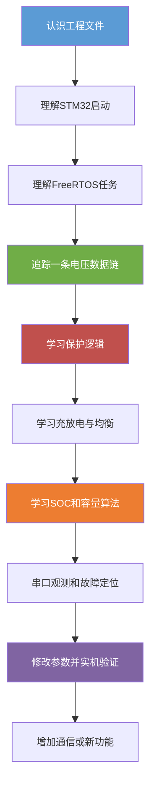
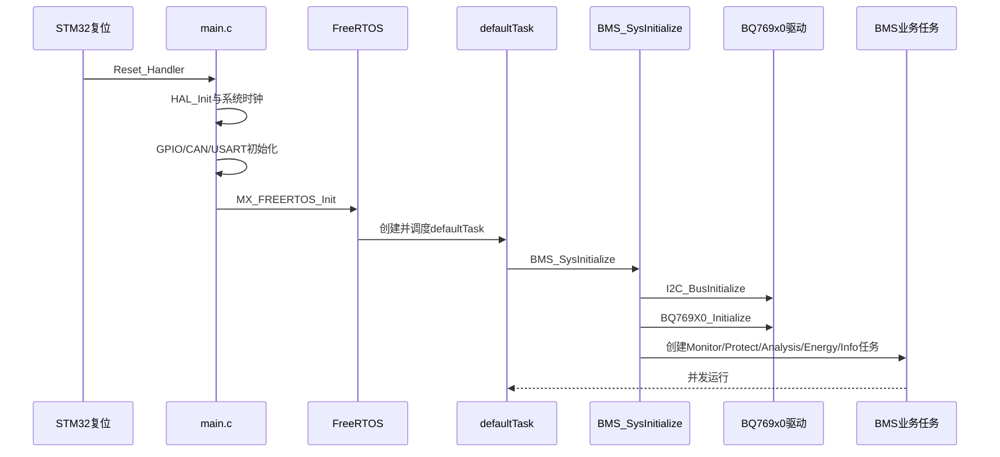
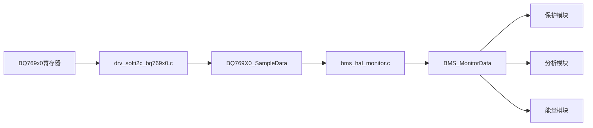
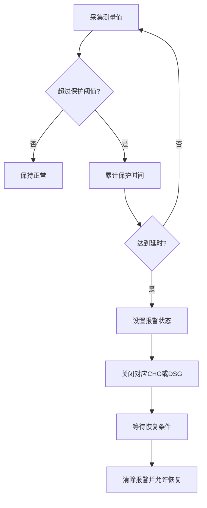
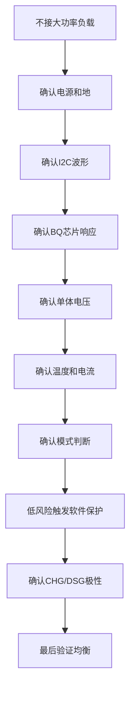

# BMS项目完整学习手册

## 文档目标

这份手册用于帮助刚开始接触本工程的开发者，从“能编译和下载”逐步学习到“能独立修改、调试和扩展 BMS 功能”。内容以当前工程代码为准，不把未实现的功能描述成已经完成的功能。

项目平台：

| 项目 | 当前工程情况 |
|---|---|
| MCU | STM32F103 系列，工程启动文件为 `startup_stm32f103xb.s` |
| IDE | Keil MDK 工程，工程文件为 `BMS.uvprojx` |
| 底层库 | STM32F1 HAL |
| 操作系统 | FreeRTOS，业务代码使用 CMSIS-RTOS2 接口 |
| 电池监测芯片 | BQ769x0 系列 |
| 芯片通信 | GPIO 模拟 I²C |
| 电池配置 | 当前 `BMS_CELL_MAX=5`、`BMS_TEMP_MAX=1` |

## 学习总路线



不要一开始从 BQ769x0 驱动的几千行代码读起。正确顺序是先知道“谁调用谁”，再研究寄存器和算法细节。

## 工程目录和职责

```text
MDK-ARM/
├── BMS.uvprojx                         Keil工程配置
├── startup_stm32f103xb.s               启动文件和中断向量表
├── Core/
│   ├── Inc/                             STM32公共头文件
│   └── Src/                             HAL生成代码和RTOS入口
├── User/
│   ├── board.c/.h                      板级初始化入口
│   ├── Bms/
│   │   ├── bms_app.c/.h                BMS总初始化
│   │   ├── bms_config.h                电芯和保护参数
│   │   ├── Core/                       BMS业务逻辑
│   │   └── Hal/                        BMS硬件抽象
│   └── Drivers/                        芯片和总线驱动
├── RTE/                                 运行时和RTOS配置
└── BMS/                                 Keil构建输出
```

### `Core` 与 `User` 的区别

`Core/Src` 主要是 STM32CubeMX 生成或维护的底层框架；`User/Bms` 是项目个人业务程序。学习和修改 BMS 功能时，优先从 `User` 目录开始。

### `.h` 和 `.c` 的关系

头文件负责对外公布：

- 类型定义
- 宏定义
- `extern` 全局变量声明
- 函数声明

源文件负责真正实现：

- 全局变量定义
- 函数实现
- 任务入口
- 私有静态函数

例如：

```c
// bms_monitor.h：只声明接口
extern BMS_MonitorDataTypedef BMS_MonitorData;
void BMS_MonitorInit(void);

// bms_monitor.c：真正定义变量并实现函数
BMS_MonitorDataTypedef BMS_MonitorData;
void BMS_MonitorInit(void)
{
    /* 创建监测任务 */
}
```

## 从复位到BMS运行



### `main.c`要掌握什么

重点观察这些函数：

```c
HAL_Init();
SystemClock_Config();
MX_GPIO_Init();
MX_CAN_Init();
MX_USART1_UART_Init();
MX_FREERTOS_Init();
osKernelStart();
```

理解目标：

- `HAL_Init()` 初始化 HAL 基础设施
- `SystemClock_Config()` 决定 CPU 和定时基准
- `MX_xxx_Init()` 初始化具体外设
- `MX_FREERTOS_Init()` 创建 RTOS 对象
- `osKernelStart()` 启动任务调度器

调用 `osKernelStart()` 后，程序主要由任务调度，不再是简单的 `main()` 顺序执行。

### `freertos.c`要掌握什么

当前默认任务首先执行：

```c
BMS_SysInitialize();
```

然后每 500 ms 翻转 LED。LED 只能表示任务仍在运行，不能代表电池没有报警。

## BMS总初始化

文件：

```text
User/Bms/bms_app.c
```

`BMS_SysInitialize()` 做两类事情。

### BQ769x0回调绑定

```c
InitData.AlertOps.ocd = BMS_ProtectHwOCD;
InitData.AlertOps.scd = BMS_ProtectHwSCD;
InitData.AlertOps.ov  = BMS_ProtectHwOV;
InitData.AlertOps.uv  = BMS_ProtectHwUV;
InitData.AlertOps.cc  = BMS_MonitorHwCurrent;
```

这是函数指针回调机制。BQ 芯片检测到事件后，驱动调用预先登记的函数：

```text
BQ芯片事件
    ↓
驱动识别事件
    ↓
调用AlertOps中的函数指针
    ↓
BMS保护模块更新报警状态
```

### 参数传递

```c
InitData.ConfigData.SCDDelay = ...;
InitData.ConfigData.OCDDelay = ...;
InitData.ConfigData.UVPThreshold = INIT_UV_PROTECT * 1000;
InitData.ConfigData.OVPThreshold = INIT_OV_PROTECT * 1000;
```

配置文件中的电压通常以 V 表示，而这里转换为 mV。学习时必须追踪完整单位链，不能只看变量名称。

## RTOS任务架构

| 任务 | 源文件 | 周期 | 作用 |
|---|---|---:|---|
| `defaultTask` | `Core/Src/freertos.c` | 500 ms | 启动BMS和LED心跳 |
| `MonitorTask` | `User/Bms/Core/bms_monitor.c` | 250 ms | 采集电压、温度、电流 |
| `ProtectTask` | `User/Bms/Core/bms_protect.c` | 200 ms | 软件保护和恢复 |
| `EnergyTask` | `User/Bms/Core/bms_energy.c` | 200 ms | 充电、放电、均衡 |
| `AnalysisTask` | `User/Bms/Core/bms_analysis.c` | 1000 ms | 统计量、SOC、容量 |
| `InfoTask` | `User/Bms/Core/bms_info.c` | 2000 ms | 信息输出 |
| `CommTask` | `User/Bms/Core/bms_comm.c` | 2000 ms | 当前为预留功能 |

线程的一般结构：

```c
void BMS_xxxInit(void)
{
    osThreadNew(BMS_xxxTaskEntry, NULL, &xxxTask_attributes);
}

static void BMS_xxxTaskEntry(void *parameter)
{
    for (;;)
    {
        /* 周期性业务 */
        osDelay(TASK_PERIOD);
    }
}
```

理解这个结构时要区分：

- `Init()` 是创建任务，不是业务循环
- `TaskEntry()` 是任务真正的入口
- `while(1)` 是任务永久运行
- `osDelay()` 让出 CPU，并决定任务执行周期

## 监测模块：数据从哪里来



主要函数：

```c
BMS_MonitorInit();
BMS_MonitorTaskEntry();
BMS_MonitorBattery();
BMS_MonitorSysMode();
BMS_MonitorStateCellVoltage();
BMS_MonitorStateBatVoltage();
BMS_MonitorStateCellTemp();
BMS_MonitorStateBatCurrent();
```

### 系统模式判断

当前代码用电流方向判断模式：

```text
BatteryCurrent >  0.02 A    充电
BatteryCurrent < -0.02 A    放电
-0.02 A~0.02 A              待机
待机持续较长时间            睡眠
```

其中 `0.02 A` 是死区，用于避免电流零点噪声引起模式抖动。

## 保护模块：安全逻辑

保护项目包括：

| 缩写 | 含义 | 主要方向 |
|---|---|---|
| OV | Over Voltage | 单体过压，通常停止充电 |
| UV | Under Voltage | 单体欠压，通常停止放电 |
| OCC | Over Current Charge | 充电过流 |
| OCD | Over Current Discharge | 放电过流 |
| SCD | Short Circuit Discharge | 放电短路 |
| OTC | Over Temperature Charge | 充电过温 |
| OTD | Over Temperature Discharge | 放电过温 |
| LTC | Low Temperature Charge | 充电低温 |
| LTD | Low Temperature Discharge | 放电低温 |

保护通常不能“超过一次就立即动作”，而是：



保护阈值和恢复阈值不同，形成回差。例如：

```text
过压保护 4.20 V
过压恢复 4.18 V
```

这样可避免电压在临界点附近反复保护和恢复。

## 能量管理：充放电与均衡

文件：

```text
User/Bms/Core/bms_energy.c
```

### 充电条件

通常需要同时满足：

```text
没有保护报警
用户允许充电
系统处于待机或适合充电的模式
SOC低于启动充电阈值
均衡资源没有冲突
```

当前配置：

```c
SOC_START_CHG_VALUE = 0.99;
SOC_STOP_CHG_VALUE  = 1;
```

### 放电条件

```c
SOC_START_DSG_VALUE = 0.01;
SOC_STOP_DSG_VALUE  = 0;
```

### 均衡条件

```c
INIT_BALANCE_VOLTAGE = 3.30 V;
BALANCE_DIFFE_VOLTAGE = 0.05 V;
```

也就是电芯电压达到均衡起始电压，并且高电压电芯相对于最低电压电芯超过设定差值，才可能启动均衡。

电芯选择使用位图：

```c
BMS_CELL_INDEX1 = 0x0001;
BMS_CELL_INDEX2 = 0x0002;
BMS_CELL_INDEX3 = 0x0004;
```

例如：

```c
BMS_CELL_INDEX1 | BMS_CELL_INDEX3
```

表示同时选择第 1 节和第 3 节。

`BalanceSem` 是均衡信号量，可以理解为均衡资源锁，避免充放电控制和均衡控制同时改变同一硬件资源。

## 分析模块：统计和SOC

### 平均电压

```c
AverageVoltage = sum(CellVoltage[i]) / CellNumber;
```

$$
V_{avg}=\frac{1}{N}\sum_{i=1}^{N}V_i
$$

### 电压差

$$
\Delta V=V_{max}-V_{min}
$$

电压差用于反映电芯一致性，也参与均衡判断。

### 实时功率

```c
PowerReal = BatteryVoltage * BatteryCurrent;
```

$$
P=U\times I
$$

单位为 `V × A = W`。

### OCV查表法

`SocOcvTab[101]` 保存 0% 到 100% 的电芯开路电压，数组元素以 mV 保存。

流程：

```text
电芯电压
    ↓
二分查找所在电压区间
    ↓
在相邻SOC点之间插值
    ↓
得到SOC
```

### 安时积分法

$$
\Delta Q=\frac{|I|\times\Delta t}{3600}
$$

充电：

$$
Q_{remain}=Q_{remain}+\Delta Q
$$

放电：

$$
Q_{remain}=Q_{remain}-\Delta Q
$$

SOC：

$$
SOC=\frac{Q_{remain}}{Q_{real}}
$$

当前额定容量：

```c
#define BMS_BATTERY_CAPACITY 2.2
```

这只是当前默认值，必须通过完整充放电测试校准。

## HAL层：隔离业务与硬件

```text
User/Bms/Hal/bms_hal_monitor.c
    负责从底层驱动取得采样值

User/Bms/Hal/bms_hal_control.c
    负责控制唤醒、休眠、CHG、DSG和均衡

User/Bms/Hal/bms_hal_config.c
    负责把保护参数写入BQ769x0
```

业务层只表达意图：

```c
BMS_HalCtrlCharge(BMS_STATE_DISABLE);
```

HAL 层决定具体动作：

```text
写BQ寄存器
或操作GPIO
或控制外部MOS驱动
```

这种分层使以后更换芯片或硬件控制方式时，不必重写保护算法和能量管理算法。

## 软件I²C驱动

文件：

```text
User/Drivers/drv_soft_i2c.c
User/Drivers/drv_soft_i2c.h
```

基本时序：

```text
START/RESTART
    ↓
从机地址+读写位
    ↓
寄存器地址
    ↓
数据字节
    ↓
ACK/NACK
    ↓
STOP
```

关键函数：

| 函数 | 作用 |
|---|---|
| `I2C_Start()` | 产生开始条件 |
| `I2C_Restart()` | 产生重复开始 |
| `I2C_Stop()` | 产生停止条件 |
| `I2C_WriteByte()` | 发送一个字节 |
| `I2C_ReadByte()` | 读取一个字节 |
| `I2C_WaitACK()` | 检查从机应答 |
| `I2C_TransferMessages()` | 执行完整消息传输 |

I²C 是开漏总线，GPIO 输出低电平有效，输出高电平本质上是释放总线，实际高电平由上拉电阻产生。

## 调试宏和日志

文件：

```text
User/Bms/Core/bms_debug.h
```

模块先定义：

```c
#define BMS_DBG_TAG "Monitor"
```

之后日志会带模块名称：

```c
BMS_INFO("Start Charge");
BMS_ERROR("Create Task Fail");
```

建议调试时关注：

- BQ769x0 是否响应
- 单体电压是否在合理范围
- 总电压是否接近单体电压之和
- 电流正负方向是否正确
- 系统模式是否正确
- 保护报警是否能够触发和恢复
- CHG、DSG 输出极性是否正确

## 函数阅读方法

每阅读一个函数，建立以下记录：

```markdown
## 函数名

### 所在文件

### 谁调用它

### 它调用谁

### 输入参数

### 返回值

### 修改了哪些全局变量

### 是否访问硬件

### 执行上下文

任务、普通函数、定时器回调还是中断。

### 单位

V、mV、A、Ah、℃、ms、s或RTOS tick。

### 异常情况

断线、NACK、越界、创建任务失败、传感器无效等。
```

## 推荐学习步骤

### 阶段一：能编译、能下载

学习：

```text
BMS.uvprojx
main.c
freertos.c
startup_stm32f103xb.s
```

完成目标：

- 知道芯片型号
- 知道程序入口
- 知道系统时钟在哪里配置
- 知道 RTOS 何时启动
- 能下载程序并观察 LED

### 阶段二：理解BMS启动

阅读：

```text
bms_app.c
bms_config.h
bms_type.h
bms_global.c/.h
```

完成目标：

- 解释 `BMS_SysInitialize()` 的每一步
- 找到电芯数量和温度数量
- 找到所有保护阈值
- 说清楚每个全局数据结构的用途

### 阶段三：只追踪单体电压

按顺序阅读：

```text
bms_monitor.c
bms_hal_monitor.c
drv_softi2c_bq769x0.c
drv_soft_i2c.c
```

只追踪：

```text
BQ寄存器
→ BQ769X0_SampleData
→ BMS_MonitorData
→ 保护判断
→ SOC/均衡判断
```

### 阶段四：理解保护

对 OV、UV、OCC、OCD 各画一张状态图，记录：

- 触发阈值
- 触发延时
- 关闭对象
- 恢复阈值
- 恢复延时
- 硬件回调还是软件任务

### 阶段五：手算SOC

使用固定示例验证：

```text
容量：2.2 Ah
电流：1 A
时间：60 s
```

确认：

$$
\Delta Q=\frac{1\times60}{3600}=0.0167Ah
$$

### 阶段六：学习均衡

记录每一节电芯的电压，手工判断：

```text
是否达到均衡起始电压
是否超过最低电芯50mV
是否存在相邻电芯限制
均衡记录位是否正确
```

### 阶段七：故障注入验证

不要直接用真实电池制造危险故障。优先使用：

- 可调电源
- 电池模拟器
- 限流电源
- 低电压小容量电池
- 示波器和万用表

先验证读取，再验证报警，最后验证 CHG/DSG 和均衡控制。

## 建议的实机验证顺序



## 必须注意的代码和硬件风险

- `BMS_CELL_MAX` 必须与实际串数、BQ 型号和硬件接线一致。
- 三元锂、磷酸铁锂和钛酸锂不能混用保护阈值。
- 电压、温度、电流、容量和时间单位必须逐层确认。
- `osDelay()` 的参数要结合当前 CMSIS-RTOS 配置确认实际时间。
- 软件 I²C 必须确认 SDA、SCL 上拉电阻和 GPIO 开漏配置。
- CHG、DSG 有效电平必须结合 MOS 驱动原理图验证。
- SOC 安时积分依赖准确采样周期和电流零点校准。
- 编译成功不代表保护功能已经经过实机安全验证。
- 任何保护阈值修改都应保留参数记录、测试条件和测试结果。

## 最终掌握标准

当你能够独立回答以下问题，就基本掌握了本项目：

```text
程序从哪个函数开始？
BMS任务在哪里创建？
单体电压从哪个寄存器进入系统？
BMS_MonitorData由谁写、由谁读？
系统如何区分充电、放电和待机？
过压保护由硬件还是软件触发？
保护延时如何实现？
保护恢复阈值为什么不同？
SOC使用了哪些算法？
安时积分的单位如何换算？
均衡为什么使用位图和信号量？
CHG/DSG最终控制了哪个硬件接口？
如何证明一次修改没有破坏保护功能？
```

最终目标不是背下每个函数，而是能从任意一个现象反向追踪：

```text
硬件现象
    → 采样数据
    → 全局状态
    → 任务判断
    → 保护或能量策略
    → HAL控制
    → 芯片寄存器或GPIO输出
```
