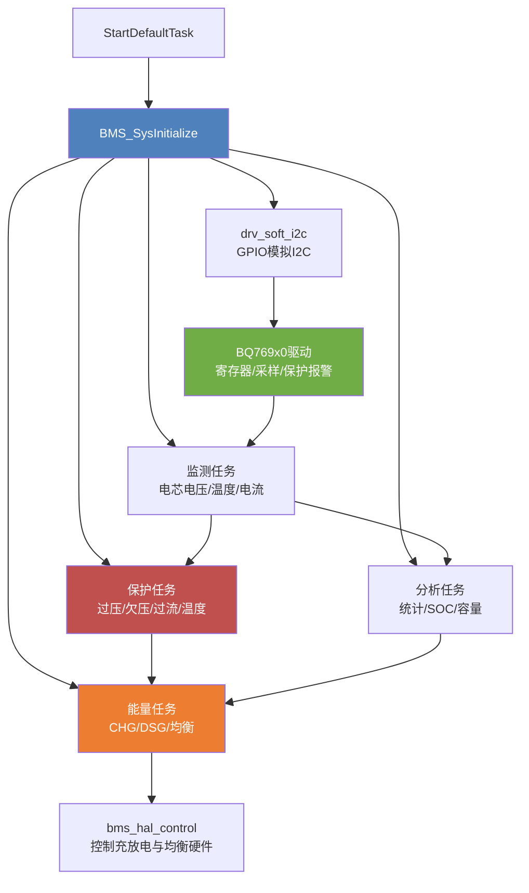
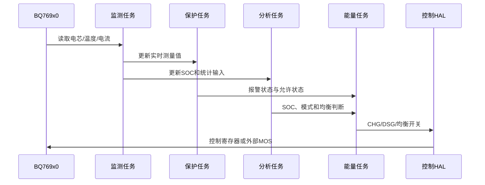

# BMS项目说明

## 项目定位

本工程运行在 `STM32F103C8` 上，底层使用 STM32 HAL，系统调度使用 CMSIS-RTOS2 接口映射的 FreeRTOS，电池监测与保护芯片为 BQ769x0。用户业务代码集中在 `User` 目录。

## 软件分层

## 启动与运行

- `MX_FREERTOS_Init()` 创建 `defaultTask`。
- `StartDefaultTask()` 调用 `BMS_SysInitialize()`。
- `I2C_BusInitialize()` 配置开漏 GPIO；`BQ769X0_Initialize()` 注册报警回调并写入保护配置。
- 监测、保护、分析、能量模块分别创建任务；通信模块当前在应用入口中关闭。
- 默认任务每 500 ms 翻转 LED。它只是运行指示，不代表 BMS 安全状态正常。

## 关键数据流

## 参数与风险提示

当前配置是最多 5 节电芯、1 路温度，默认按三元锂参数设置。`User/Bms/bms_config.h` 中的电压、温度、电流和延时是安全相关参数，必须结合实际电芯、采样电阻、MOS 驱动极性和硬件原理图重新校准。工程已有构建产物不能替代实机验证，尤其要单独验证报警回调、CHG/DSG 极性、均衡电流和断线场景。
