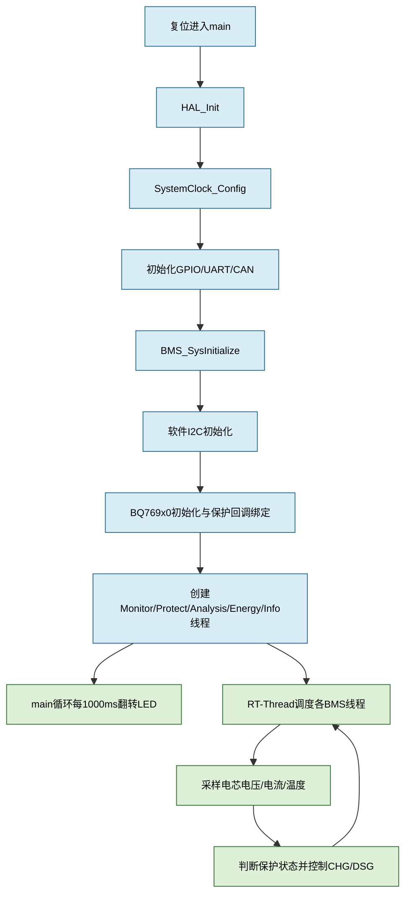

# BMS项目结构与运行说明

## 🔋 项目定位

本工程运行在 `STM32F103` 上，使用 `STM32 HAL` 完成芯片外设初始化，使用 `RT-Thread` 管理任务，使用 `BQ769x0` 完成多串锂电池的电压、电流、温度采样以及硬件保护。

工程中的个人程序主要位于 `User` 目录：

| 层次 | 目录 | 主要职责 |
|---|---|---|
| 应用入口 | `User/Bms/bms_app.c` | 组织BMS系统初始化顺序 |
| BMS核心 | `User/Bms/Core` | 监控、保护、SOC/容量分析、能量管理、信息输出 |
| BMS硬件适配 | `User/Bms/Hal` | 将核心层动作转换为硬件驱动调用 |
| 外设驱动 | `User/Drivers` | 软件I2C、BQ769x0、CAN、RS485 |
| 板级支持 | `User/board.c`、`User/board.h` | RT-Thread与板级硬件连接 |

## 🧭 启动与运行链路

## 🧩 各核心模块

### `bms_monitor`

周期读取电芯电压、电池总压、电流和温度，并更新全局状态。它是其他模块的数据来源。

### `bms_protect`

同时处理软件阈值保护和BQ769x0硬件告警。过压、欠压、过流、短路、过温等状态最终通过HAL控制充电或放电MOS。

### `bms_analysis`

根据开路电压、安时积分等方法估算SOC和剩余容量。SOC是估算值，必须结合采样精度、初始容量和电流方向理解。

### `bms_energy`

管理充放电允许状态和电芯均衡。均衡动作必须服从保护状态，不能绕过保护层直接打开功率通道。

### `bms_info`

周期输出电池状态、容量和故障信息，便于通过串口观察运行结果。

## ⚠️ 阅读代码时要注意

- `BMS_SysInitialize()`当前没有调用 `BMS_CommInit()`，因此通信模块是否启用要以当前源码为准。
- BQ769x0的 `AlertOps` 回调可能由GPIO中断路径触发；中断回调中不应执行阻塞式I2C或复杂打印。
- `rt_thread_mdelay()`的单位是毫秒，但线程是否已经启动取决于RT-Thread启动流程和工程配置。
- 本次注释不改变变量、参数、调用顺序、延时、阈值或硬件配置。

## 🧪 建议调试顺序

1. 先确认时钟、GPIO、UART、CAN初始化成功。
2. 观察软件I2C是否能读到BQ769x0寄存器。
3. 检查电芯电压和总压的单位、串数及极性。
4. 验证正常状态下CHG/DSG控制逻辑。
5. 分别制造过压、欠压、过流和温度异常，确认硬件告警与软件状态一致。

