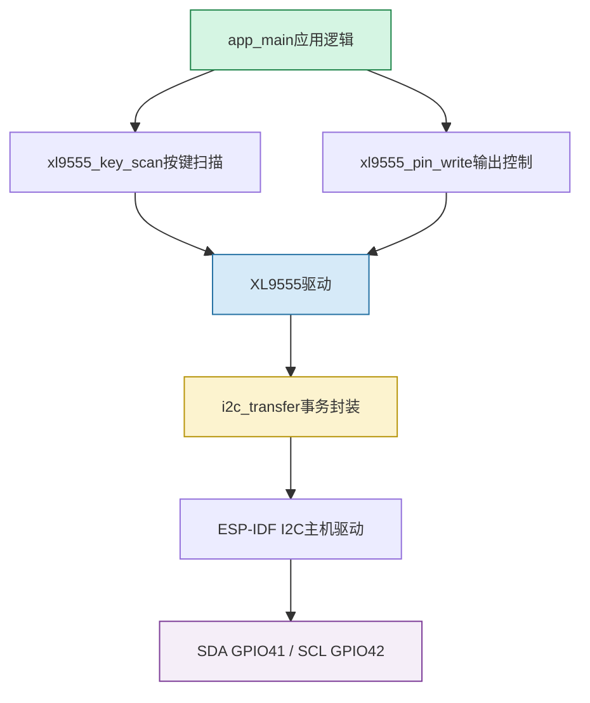

# ESP32-S3 I²C IO扩展项目说明

## 项目目标

本项目演示 ESP32-S3 作为 I²C 主机，使用 XL9555（I²C 地址 `0x20`）扩展 16 路 GPIO。程序读取 XL9555 上的 `KEY0~KEY3`，并控制 XL9555 上的蜂鸣器以及 ESP32-S3 的板载 LED。

## 硬件连接

| 信号 | 引脚 | 作用 |
|---|---:|---|
| I²C SDA | GPIO41 | 双向数据线 |
| I²C SCL | GPIO42 | 时钟线 |
| XL9555 INT | GPIO40 | 中断状态输入，当前代码只读取、未配置中断 |
| LED | GPIO1 | 板载 LED，低电平点亮 |
| BEEP | XL9555 P0.3 | 低电平打开蜂鸣器 |
| KEY0~KEY3 | XL9555 P1.7~P1.4 | 低电平表示按下 |

## 软件分层



## 启动流程

`app_main()` 先初始化 NVS，再初始化 GPIO LED、I²C0 和 XL9555。XL9555 初始化时将 `0xF003` 写入配置寄存器：低字节 `0x03` 和高字节 `0xF0` 中的 `1` 配置为输入，因此 P1.4~P1.7 为按键输入，P0.0~P0.5 为输出。随后程序关闭蜂鸣器和相关输出，进入轮询循环。

## I²C 读写流程

读取 XL9555 输入寄存器时，事务为：

```text
START → 0x20(W) → 寄存器号0x00 → RESTART → 0x20(R) → P0 → P1 → STOP
```

写寄存器时，事务为：

```text
START → 0x20(W) → 寄存器号 → 数据P0 → 数据P1 → STOP
```

代码中的 `XL9555_ADDR` 是未左移的 7 位地址；`i2c_transfer()` 内部通过 `addr << 1` 拼接读写位，这是正确的 ESP-IDF 旧版 I²C 命令格式。

## 按键处理

`xl9555_key_scan(0)` 使用 `key_up` 状态变量实现单次触发：检测到低电平后延时约 10 ms 消抖，并只返回一次 `KEYx_PRES`；只有所有按键恢复高电平后，才允许下一次触发。主循环每次扫描后延时约 200 ms。

## 需要重点检查的代码问题

`xl9555_pin_write()` 当前先调用 `xl9555_read_byte()`，该函数读取的是输入寄存器 `0x00`。对于输出的读改写，通常应读取输出寄存器 `0x02`，否则可能把输入状态误当成输出锁存值，导致修改一个输出位时影响其他输出位。建议后续增加“读取指定寄存器”的接口，并用输出寄存器作为读改写源。

另外，`XL9555_INT` 当前只是在主循环中打印字符串 `123`，没有配置 GPIO 中断，也没有把中断用于按键唤醒；如果项目需要低功耗或事件驱动，应再增加 GPIO ISR 与任务通知机制。

## 编译验证

在 ESP-IDF 环境中执行：

```powershell
idf.py build
idf.py flash monitor
```

串口应能看到启动信息，并在按键按下时看到对应的 `KEYx has been pressed` 日志。
